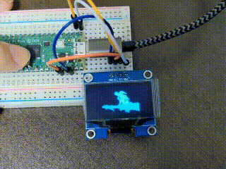

# Bad Apple!! on OLED
- Play "Bad Apple!!" on OLED
	- on Raspberry Pi
	- on Raspberry Pi Pico



## Hardware
- OLED (128x64)
	- SH1106 (I2C)
		- set `kIsSh1106 = true`
	- or
	- SSD1306 (I2C)
		- set `kIsSh1106 = false`

## on Raspberry Pi 4
### Connection
- i2c1
	- GPIO2(SDA)
	- GPIO3(SCL)
	- 3V3
	- GND

### Build
```
git clone https://github.com/iwatake2222/pico-badapple.git
cd pico-badapple
mkdir build && cd build

cmake .. -DBUILD_FOR_RASPBERRY_PI_PICO=off
make
```

## on Raspberry Pi Pico
### Connection
- i2c0
	- GP0(SDA, 1)
	- GP1(SCL, 2)
	- 3V3(36)
	- GND(38)

### Build
```
git clone https://github.com/iwatake2222/pico-badapple.git
cd pico-badapple
git submodule update --init
# git submodule update --init --recursive
mkdir build && cd build

# For Windows
cmake .. -G "NMake Makefiles" -DBUILD_FOR_RASPBERRY_PI_PICO=on
nmake

# For Windows MSYS2 (Run the following commands on MSYS2)
# cmake .. -G "MSYS Makefiles" -DCMAKE_BUILD_TYPE=Debug -DPICO_DEOPTIMIZED_DEBUG=on
cmake .. -G "MSYS Makefiles" 
make
```

## Convert image data
- `tool_converter` project converts image file(jpeg/mp4) to bin and C array
- copy generated C array code and paste to `VideoData.h`

## Acknowledgements
- pico-sdk
	- Copyright 2020 (c) 2020 Raspberry Pi (Trading) Ltd.
- Original video
	- https://www.nicovideo.jp/watch/sm8628149
